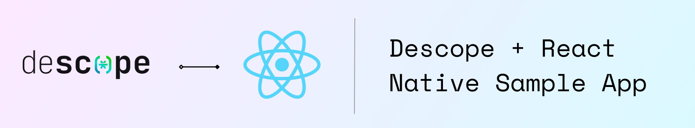

# Descope React Native Sample App with Native Flows

[](https://opensource.org/licenses/MIT)

Welcome to the **Descope React Native Sample App**, a demonstration of how to integrate Descope's powerful native flows into a React Native application. This project is bootstrapped using [`@react-native-community/cli`](https://github.com/react-native-community/cli) and leverages the Descope React Native SDK to manage session authentication seamlessly.

## Features
This sample app includes:
A fully functional React Native application demonstrating multiple approaches to integrate Descope authentication:
- **Option 1: Simple Flow:** A dedicated authentication screen navigated to from the main interface. This approach provides a clear and isolated experience for user sign-in/sign-up.
- **Option 2: Modal Flow:** A modal overlay that presents the authentication interface. This method offers a focused, yet non-intrusive user experience by keeping the user within the same screen context.
- **Option 3: Inline Flow:** The authentication form is embedded directly within the current screen.

Each option showcases how to use the Descope FlowView component, manage sessions, and handle user transitions post-authentication — tailored to different UX preferences and app flows.

## Getting Started

### Prerequisites

Ensure you have completed the [React Native Environment Setup](https://reactnative.dev/docs/environment-setup) till the "Creating a new application" step. You'll also need:

- **Node.js** and **npm** or **Yarn**
- **Android Studio** or **Xcode** (for emulators/simulators)

### Running the App

1. Clone this repository:

   ```bash
   git clone https://github.com/descope-sample-apps/react-native-sample-app.git
   cd react-native-sample-app
   ```

2. Install dependencies:

   ```bash
   npm install
   npm install @descope/react-native-sdk
   npm install @react-navigation/native @react-navigation/native-stack
   npm install react-native-screens react-native-safe-area-context
   npm install react-native-config react-native-animatable
   # OR
   yarn install
   yarn add @descope/react-native-sdk
   yarn add @react-navigation/native @react-navigation/native-stack
   yarn add react-native-screens react-native-safe-area-context
   yarn add react-native-config react-native-animatable
   ```

3. (iOS only) Install CocoaPods:
   ```bash
   cd ios && pod install && cd ..
   # OR
   yarn ios
   ```

4. Build and run the app for iOS/Android:
   #### For Android

   ```bash
   npm run android
   # OR
   yarn android
   ```

   #### For iOS

   ```bash
   npm run ios
   # OR
   yarn ios
   ```

5. Create a `.env` file in your root directory, and copy the contents from the example file `.env.example`.
   - Change `projectId` and `baseURL` in the `.env` file to match your Descope project.
   - Change `flowId` in the `.env` file to choose your appropriate Descope Flow.
   - Select a flow navigation option (simple/modal/inline) by uncommenting it's `AUTH_FLOW_TYPE` field.

### Notes on Session Management and Flows

- The app uses the **`useSession` hook** for session management. Learn more in the [Descope React Native Documentation](https://docs.descope.com/build/guides/client_sdks/react-native/).

## Learn More

To dive deeper, check out:

- [Descope Documentation](https://docs.descope.com/getting-started/react-native) – Guides, API references, and more.
- [React Native SDK](https://github.com/descope/descope-react-native) – Official React Native documentation.

## License

This sample app is licensed under the [MIT License](https://opensource.org/licenses/MIT).